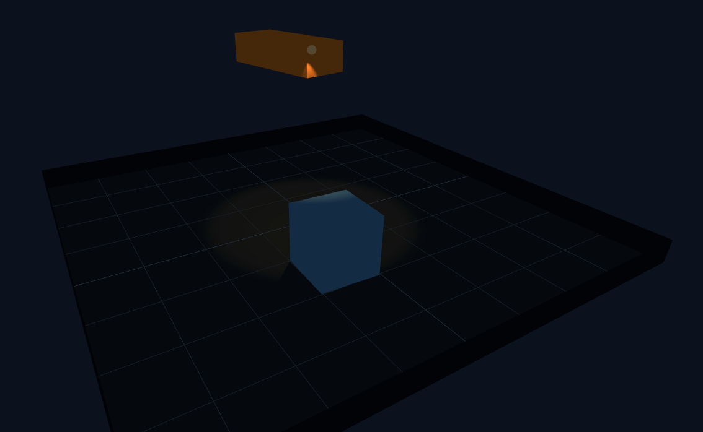

# Lighting Demo

A simple **3D lighting and shadows demo** built with **React, TypeScript, and Three.js**, showcasing room layout, objects, and spotlights with soft shadows.  

👉 **Live Demo**: [Lighting Demo on GitHub Pages](https://waguei-andrea.github.io/lighting-demo/)

---

## ✨ Features
- Built with **Vite + React + TypeScript**
- Real-time **3D rendering** powered by **Three.js**
- OrbitControls for interactive camera movement
- Soft shadows with SpotLight & Ambient light
- Simple room layout with floor, low walls, and boxes

---

## 🛠️ Tech Stack
- [React](https://reactjs.org/)
- [TypeScript](https://www.typescriptlang.org/)
- [Three.js](https://threejs.org/)
- [Vite](https://vitejs.dev/)
- [gh-pages](https://www.npmjs.com/package/gh-pages) for deployment

---

## 🚀 Getting Started

### 1. Clone the repo
```bash
git clone https://github.com/waguei-andrea/lighting-demo.git
cd lighting-demo
```

### 2. Install dependencies
```bash
npm install
```

### 3. Run locally
```bash
npm run dev
```
The project will run at [http://localhost:5173](http://localhost:5173)


## 📦 Deployment
This project uses GitHub Pages.

### 1. Update vite.config.ts with the repo name:
```bash
export default defineConfig({
  base: '/lighting-demo/',
})
```

### 2. Deploy:
```bash
npm run deploy
```

## 📸 Preview


## 📜 License
MIT License © 2025 Andrea